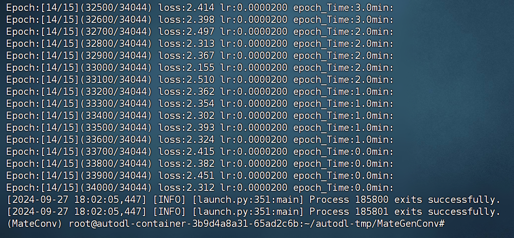

<div align="center">

# 中文对话0.2B小模型 Matelike_Chinese_chat_0.2B 

中文(./README.en.md)  

</div>
 

# 一、👋介绍 
现在的大语言模型的参数往往较大，消费级电脑单纯做推理都比较慢，更别说想自己从头开始训练一个模型了。本项目的初衷是从0开始训练一个生成式语言模型，在训练过程中不断学习和验证自己掌握的一些浅薄知识
包括数据清洗、tokenizer训练、模型预训练、SFT指令微调、RLHF优化等。 

Matelike_Chinese_chat_0.2B 为中文对话小模型，模型参数只有0.2B，可以在最低4GB显存的机器进行预训练（`batch_size=1`，`fp16`或者` bf16`），`float16`加载、推理大约396MB显存。 


- 公开所有预训练、SFT指令微调、DPO偏好优化数据集来源。
- 使用`Huggingface`NLP框架，包括`transformers`、`accelerate`、`trl`等。
- 由于是边做项目边学习，因此，模型结构大部分类均借助pytorch手动实现封装，理解原理，跑通数据流。Embedding，RMSnorm，带旋转位置编码，以及kv缓存的多头注意力层，SWiGULE前馈神经网络和前沿的门控Moe前馈神经网络。以及构造TransformerBlock类封装模型部分
- 自实现`pretain,full_sft_trin`，支持单机单卡、单机多卡进行预训练、SFT微调。
- 预训练：采用teacher forcing策略，进行无监督自回归预训练，采用**前瞻掩码mask**遮蔽下文内容，实现并行训练。
    - 开源所有数据清洗（这一部分其实没怎么做，就是整理数据到一个文件，因为选取的数据都是huggingface上大佬提供的开源数据集）、数据集构造（主要是RLHF阶段，用自己的SFT阶段模型构造rejected数据）、数据集加载优化等流程；
    - tokenizer训练采用的方法是BPE；
    - 预训练时支持每两千steps保存一次模型权重，建议使用nohup，或者tmux进行监控，防止终端与服务器断开导致中途训练失败。
    - 预训练数据通过**LLM_pretrain.ipynb**里面的数据格式检查和完整性检查，在以每chunk_size = 50000的规模封装一次，存进二进制文件**pretrain_data.bin**中，bin文件适合大规模数据存储和传输，高效能数据处理和存储空间小；sft阶段和RLHF阶段数据使用parquet文件格式进行存储，具有存储效率高，查询性能高，兼容性高的特点
    - 训练日志记录，打印中间过程loss变化和进程。
- SFT微调：开源SFT数据集及数据处理过程。
    - 自实现`full_sft_trin`支持prompt指令微调；
    - 支持`Huggingface trainer`的`sequence to sequence`微调；
    - 支持传统的低学习率，只训练decoder层的微调。
- RLHF偏好优化：准备使用PPO进行优化（目前正在进行中）。
  


# 二、🛠️Matelike_Chinese_chat_0.2B模型训练过程 

## 2.1 预训练数据集
所有数据集均来自modelscope社区的大佬**出门问问**分享的**seq-monkey 序列猴子开源数据集 1.0**  (https://modelscope.cn/datasets/ddzhu123/seq-monkey)，
序列猴子是出门问问提供的超大规模语言模型，序列猴子数据集是用于训练序列猴子模型的数据集合，数据集涉及领域包括：中文通用文本语料、古诗今译语料、文本生成语料，不需要清洗，非常nice的json格式文件。
总共语料**1300万**条，经过检查，0条损坏，0条编码错误，可用数据**1300万**条 

SFT微调和DPO优化数据集见下文。

## 2.2 模型
LLama模型（Large Language Model Meta AI），论文见（LLaMA: Open and Efficient Foundation Language Models），详情见(https://github.com/meta-llama/llama/tree/main/llama)。

模型源码参考github，见：(https://github.com/meta-llama/llama/tree/main/llama)。

模型配置见[LMConfig.json](https://github.com/chengxiang123aa/Matelike_chinese_chat_0.2b/blob/main/model/LMConfig.py)，官方的`LLama`：为decoder only结构，`decoder layer `为32层，本项目这个参数修改为8层。 

模型参数：0.2B。词表大小：6400，纯中文。

## 2.3 训练过程
硬件：
```bash
# 预训练阶段：
CPU: 224 vCPU Intel(R) Xeon(R) Xeon(R) Platinum 8480C CPU @ 2.00GHz
内存：2.0 Ti
显卡：H00(80GB) * 8  (公司服务器，不用白不用，周末都空闲了)    
其实两张RTX 3090(24GB),能够以batch_size = 32跑起来，不过卡多训练快嘛，不用白不用
# sft及dpo阶段：
CPU: 224 vCPU Intel(R) Xeon(R) Xeon(R) Platinum 8480C CPU @ 2.00GHz
内存：2.0 Ti
显卡：H00(80GB) * 8
```
1. **tokenizer 训练**： 利用数据集**tokenizer_train.jsonl**，使用tokenizers库的Trainer，用*BPE*方法训练自己的tokenizer，由于使用的数据比较少，并且vacab_size也只有6400个，因此只需要5分钟就可以训练好。

2. **decoder无监督预训练**：学习率为`0`到`2e-4`线性增长，在从`2e-4`以余弦衰减到`2e-5`的动态学习率，预训练时间为6小时（8张H100）。训练损失开始为8.875左右，最终为2.2左右： 

 

 

3. **prompt监督微调（SFT）**：使用`belle`指令训练数据集（指令和回答长度都在512以下），学习率从`0`到`1e-4`，之后以余弦衰减到`1e-5`的动态学习率，微调时间3个小时。微调损失开始为2.2左右，最终稳定在1.4左右： 
   


 


4. **dpo直接偏好优化（RLHF）**：数据集[alpaca-gpt4-data-zh](https://huggingface.co/datasets/c-s-ale/alpaca-gpt4-data-zh)作为`chosen`文本，步骤`2`中SFT模型对数据集中的prompt做批量`generate`，得到`rejected`文本，耗时13个小时。后续有待更新.........


## 2.4 现阶段对话效果展示
### 2.4.1 经过指令微调之后的模型效果展示
默认使用`huggingface transformers`的 `AutoTokenizer`加载分词器，**load_state_dict**加载模型权重参数。


存在问题：预训练数据集只有1300多万，且涵盖领域也不够充分，模型参数也仅0.2B，不能涵盖所有方面，会有答非所问、废话生成器的情况。


# 三、📑使用说明

## 3.1 快速开始：
- 模型暂未全部训练完毕，训练完毕会上传huggingface

## 3.2 从克隆仓库代码开始

### 3.2.1 克隆项目：
```bash
git clone --depth 1 https://github.com/chengxiang123aa/Matelike_chinese_chat_0.2b.git

cd Matelike_chinese_chat_0.2b
```
### 3.2.2 安装依赖 

本项目推荐使用`python 3.10`，过老的python版本可能不兼容所依赖的第三方库。  

pip安装：
```bash
pip install -r ./requirements.txt
``` 

如果pip安装了CPU版本的pytorch，可以通过下面的命令安装CUDA版本的pytorch：
```bash
# pip 安装torch + cu118
pip3 install torch --index-url https://download.pytorch.org/whl/cu118
```

conda安装：
```bash
conda install --yes --file ./requirements.txt
```

### 3.2.3 下载预训练模型及模型配置文件

暂未上传模型权重，还不能进行使用


## 3.3 Tokenizer训练  

1. 准备txt语料  

语料要求尽可能全，建议添加多个语料，如百科、代码、论文、博客、对话等。   

本项目以wiki中文百科为主。获取中文wiki语料方法：中文Wiki下载地址：[zhwiki](https://dumps.wikimedia.org/zhwiki/)，下载`zhwiki-[存档日期]-pages-articles-multistream.xml.bz2`文件，大概2.7GB， 将下载的bz2文件转换为wiki.txt参考：[WikiExtractor](https://github.com/apertium/WikiExtractor)，再利用python的`OpenCC`库转换为简体中文，最后将得到的`wiki.simple.txt`放到项目根目录的`data`目录下即可。多个语料请自行合并为一个`txt`文件。

由于训练tokenizer非常耗内存，如果你的语料非常大（合并后的`txt`文件超过2G），建议对语料按照类别、比例进行采样，以减少训练时间和内存消耗。训练1.7GB的`txt`文件需要消耗48GB左右的内存（预估的，我只有32GB，频繁触发swap，电脑卡了好久T_T），13600k cpu耗时1小时左右。

2. 训练tokenizer

`char level`和`byte level`的区别如下（具体使用上的区别请自行检索资料）。默认训练`char level`的tokenizer，如果需要`byte level`，在`train_tokenizer.py`中设置`token_type='byte'`即可。

```python
# 原始文本
txt = '这是一段中英混输的句子, （chinese and English, here are words.）'

tokens = charlevel_tokenizer.tokenize(txt)
print(tokens)
# char level tokens输出
# ['▁这是', '一段', '中英', '混', '输', '的', '句子', '▁,', '▁(', '▁ch', 'inese', '▁and', '▁Eng', 'lish', '▁,', '▁h', 'ere', '▁', 'are', '▁w', 'ord', 's', '▁.', '▁)']

tokens = bytelevel_tokenizer.tokenize(txt)
print(tokens)
# byte level tokens输出
# ['Ġè¿Ļæĺ¯', 'ä¸Ģ段', 'ä¸Ńèĭ±', 'æ··', 'è¾ĵ', 'çļĦ', 'åı¥åŃIJ', 'Ġ,', 'Ġ(', 'Ġch', 'inese', 'Ġand', 'ĠEng', 'lish', 'Ġ,', 'Ġh', 'ere', 'Ġare', 'Ġw', 'ord', 's', 'Ġ.', 'Ġ)']
```
开始训练：
```python
# 确保你的训练语料`txt`文件已经data目录下
python train_tokenizer.py
```

## 3.4 decoder only 无监督预训练 

1. 预训练数据集示例
```json
{
    "text": "花园街（是香港油尖旺区的一条富有特色的街道，位于九龙旺角东部，北至界限街，南至登打士街，与通菜街及洗衣街等街道平行。现时这条街道是香港著名的购物区之一。位于亚皆老街以南的一段花园街，也就是\"波鞋街\"整条街约150米长，有50多间售卖运动鞋和运动用品的店舖。旺角道至太子道西一段则为排档区，售卖成衣、蔬菜和水果等。花园街一共分成三段。明清时代，花园街是芒角村栽种花卉的地方。此外，根据历史专家郑宝鸿的考证：花园街曾是1910年代东方殷琴拿烟厂的花园。纵火案。自2005年起，花园街一带最少发生5宗纵火案，当中4宗涉及排档起火。2010年。2010年12月6日，花园街222号一个卖鞋的排档于凌晨5时许首先起火，浓烟涌往旁边住宅大厦，消防接报4"
}
```
   
2. jupyter-lab 或者 jupyter notebook:  

    见文件`LLM_pretrain.ipynb`，推荐使用jupyter-lab，避免考虑与服务器断开后终端进程被杀的情况。 

3. 控制台： 

    控制台训练需要考虑连接断开后进程被杀的，推荐使用进程守护工具`Supervisor`或者`screen`建立连接会话。
    也可以使用nohup 启动训练，挂在后台，或者使用tmux，以便中断后，还能在终端观测到训练过程
  
    单机多卡：
    ```bash
    # 本项目实现的pretrain.py
    deepspeed --master_port 29500 --num_gpus=4 pretrain.py --epochs 15
    ```

## 3.5 SFT微调 
SFT数据集全部来自[BELLE](https://github.com/LianjiaTech/BELLE)大佬的贡献，感谢。SFT数据集分别为：[generated_chat_0.4M](https://huggingface.co/datasets/BelleGroup/generated_chat_0.4M)、[train_0.5M_CN](https://huggingface.co/datasets/BelleGroup/train_0.5M_CN)和[train_2M_CN](https://huggingface.co/datasets/BelleGroup/train_2M_CN)，清洗后剩余约250万行。
sft指令微调数据集示例：
```json
{
    "prompt": "解释什么是欧洲启示录",
    "response": "欧洲启示录（The Book of Revelation）是新约圣经的最后一卷书，也被称为《启示录》、《默示录》或《约翰默示录》。这本书从宗教的角度描述了世界末日的来临，以及上帝对世界的审判和拯救。 书中的主题包括来临的基督的荣耀，上帝对人性的惩罚和拯救，以及魔鬼和邪恶力量的存在。欧洲启示录是一个充满象征和暗示的文本，对于解读和理解有许多不同的方法和观点。"
}
```

参考`data`目录下的示例`parquet`文件制作自己的数据集，数据集格式：`parquet`文件分两列，一列`prompt`文本，表示提示语，一列`response`文本，表示期待的模型输出。
微调细节见`train/full_sft_train.py`文件, 设置好gpu个数和训练的epoch参数就可以了，将进行微调，微调默认会冻结embedding层，只训练decoder层。如需要冻结其他参数，请自行调整代码。 

运行SFT微调：
``` bash
# 本项目实现的trainer， 添加参数`--num_gpus,--epochs`即可.
deepspeed --master_port 29500 --num_gpus=2 full_sft.py --out_dir out --epochs 5
```

## 3.6 RLHF（强化学习人类反馈优化方法）

偏好方法这里介绍常见的两种：PPO和DPO，具体实现请自行搜索论文及博客。

1.  PPO方法（近似偏好优化,Proximal Policy Optimization）（计划采用PPO方法进行RLHF）  
    步骤1：使用微调数据集做有监督微调（SFT， Supervised Finetuning）。   
    步骤2：使用偏好数据集（一个prompt至少包含2个回复，一个想要的回复，一个不想要的回复。多个回复可以按照分数排序，最想要的分数最高）训练奖励模型（RM， Reward Model）。可使用`peft`库快速搭建Lora奖励模型。   
    步骤3：利用RM对SFT模型进行有监督PPO训练，使得模型满足偏好。   

2.  使用DPO（直接偏好优化，Direct Preference Optimization）微调
    在获得SFT模型的基础上，无需训练奖励模型，取得正向回答（chosen）和负向回答（rejected）即可开始微调。微调的`chosen`文本来自原数据集[alpaca-gpt4-data-zh](https://huggingface.co/datasets/c-s-ale/alpaca-gpt4-data-zh)，拒绝文本`rejected`来自SFT微调1个epoch后的模型输出，另外两个数据集：[huozi_rlhf_data_json](https://huggingface.co/datasets/Skepsun/huozi_rlhf_data_json)和[rlhf-reward-single-round-trans_chinese](https://huggingface.co/datasets/beyond/rlhf-reward-single-round-trans_chinese)，合并后共8万条dpo数据。
    
    dpo数据集处理过程见`data_process.py`。
    
DPO偏好优化数据集示例：
```json
    {
        "prompt": "为给定的产品创建一个创意标语。，输入：可重复使用的水瓶。",
        "chosen": "\"保护地球，从拥有可重复使用的水瓶开始！\"",
        "rejected": "\"让你的水瓶成为你的生活伴侣，使用可重复使用的水瓶，让你的水瓶成为你的伙伴\""
    }
```


# 五、🤔其他事项
本项目不承担开源模型和代码导致的数据安全、舆情风险或发生任何模型被误导、滥用、传播、不当利用而产生的风险和责任。

<!-- # 提示
```bash
# 导出项目依赖的包：
pipreqs --encoding "utf-8" --force
``` -->

